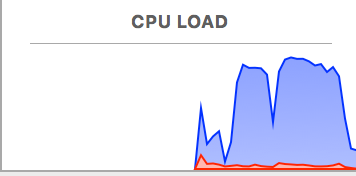

# GORM : batch importing large datasets and a performance benchmarking app


<!-- TOC depthFrom:2 depthTo:6 withLinks:1 updateOnSave:1 orderedList:0 -->

- [Intro](#intro)
- [How to run the benchmarks](#how-to-run-the-benchmarks)
- [Changing default pool size](#changing-default-pool-size)
- [The Benchmarks](#the-benchmarks)
- [Bench Mark Results and details](#bench-mark-results-and-details)
- [Pass 1 multi-thread - standard grails binding baseline](#pass-1-multi-thread-standard-grails-binding-baseline)
- [Pass 2 multi-thread](#pass-2-multi-thread)
- [Pass 3 multi-thread - copy props](#pass-3-multi-thread-copy-props)
	- [CPU Load during Gparse batch insert](#cpu-load-during-gparse-batch-insert)
- [System specs](#system-specs)
- [Conclusions](#conclusions)
	- [Optimum setting for Gpars pool size.](#optimum-setting-for-gpars-pool-size)
	- [Questions answered by above conclusion.](#questions-answered-by-above-conclusion)
- [Batching inserts and updates with hibernate](#batching-inserts-and-updates-with-hibernate)	
- [References and reading](#references-and-reading)

<!-- /TOC -->

## Intro

The application runs large batch inserts (115K records) in different ways. The goal is to decide the optimum way to run large batch inserts with Gorm.

The goal is to have good benchmarks to measure and answer following questions.

- Fastest way to persist/insert large batches using gorm.
- Show advantages of using multi-core.
- Does binding slow it down, why, can it be optimized, best alternative
- Does valiation slow it down, why, can it be optimized
- Does Auditstamp slow it down, can it be optimized
- Does Repostories slow it down
- Do custom Id generator slow it down, or improve speed
- does @compileStatic speed things up, where does it matter? does it help to have it on the domains?

## How to run the benchmarks

- There is a script ```run-benchmarks.sh``` which will run the benchmarks
- Run ```./run-benchmarks.sh```
- See the script for more details.


## Changing default pool size

By default benchmarks uses default gpars pool size which is (availableProcessors + 1) which can be modified by passing system property ```gpars.poolsize=xx```
Example: ```java -Dgpars.poolsize=5 -jar grails-gpars-batch-load-benchmark-0.1.war```

## The Benchmarks

- GparsBatchInsertBenchmark - Runs the batches in parallel, each batch with the same size as jdbc batch size (50).
- GparsBatchInsertWithoutDaoBenchmark - Same as above, but without using dao for inserting records.
- GparsBatchInsertWithoutValidation - Runs the batches with gpars but with grails domain validation tunred off during save using ```domain.save(false)```
- GparsThreadPerTransactionBenchmark - Runs the inserts in parallel with one thread per transaction.
- BatchInsertWithDataFlawQueueBenchmark - Runs the batch inserts in parallel using Gprase dataflow operator [see](http://www.gpars.org/webapp/quickstart/index.html#__strong_dataflow_concurrency_strong)
- SimpleBatchInsertBenchmark - Batch inserts but without gpars parallelism.
- CommitEachSaveBenchmark - Insert each record in individual transactions.
- OneBigTransactionBenchmark - Inserts all records within a single big transaction.
- DataFlawQueueWithScrollableQueryBenchmark : same as BatchInsertWithDataFlawQueueBenchmark but the data is being loaded from another table simultanously using scrollable resultset.

Note: All of above benchmarks are run with and without data binding, and you will see the results for both.


## Bench Mark Results and details

* 115k CSV records on a MacBook pro 2.5 GHz Intel Core i7. 2048 mb ram was given to the VM and these were run using ```java -jar grails-gpars-batch-load-benchmark-0.1.war```
* All of these have jdbc.batch_size = 50 and use the principals from #2 above and flush/clear every 50 rows
* The winner seems to be gpars and batched (smaller chunks) transactions


**Results with Gparse pool size 8**

|                      | All records in single transaction | Commit each record | Batched Transaction - Without Gpars  | Batched Transactions - With Gpars  | Gpars single transaction per thread  |
|----------------------|-----------------------------------|--------------------|--------------------------------------|------------------------------------|--------------------------------------|
| With data binding    | 40.807                           | **81.521**          | 43.569                              |  12.32                              | 22.372                               |


**Results for Gparse batched with different pool sizes**

|            Pool size            | 2 threads | 3 threads | 4 threads | 5 threads | 6 threads | 7 threads | 8 threads | 9 threads | 10 threads | 11 threads | 12 threads |
| ------------------------------- | --------- | --------- | --------- | --------- | --------- | --------- | --------- | --------- | ---------- | ---------- | ---------- |
| With data binding               | 24.522    | 22.473    | 16.063    | 17.363    | 16.698    | 14.53     | 12.32     | 12.012    | 12.145     | 14.785     | 14.081     |
| Without data binding            | 12.302    | 12.593    | 9.52      | 8.586     | 8.509     | 7.46      | 6.842     | 6.27      | 6.696      | 6.896      | 7.074      |
| No validation                   | 15.335    | 17.588    | 9.906     | 10.3      | 10.724    | 9.489     | 7.993     | 8.112     | 8.203      | 9.069      | 9.032      |
| No validation & No data binding | 10.619    | 9.311     | 7.088     | 7.59      | 7.997     | 8.088     | 6.558     | 5.896     | 5.683      | 6.223      | 6.594      |


|               Gpars Benchs                |  time  |
| ----------------------------------------- | ------ |
| with databinding                          | 12.32  |
| no binding                                | 6.842  |
| No autowire                               | 12.969 |
| no validation                             | 7.993  |
| no binding, no autowire,  no validation   | 6.221  |
| grails date stamp fields                  | 14.726 |
| audit-trail stamp fields (user and dates) | 21.728 |
| no dao                                    | 10.603 |
| DataflowQueue (CED Way)                   | 12.356 |
| Custom IdGenerator                        | 12.532 |

<!-- BENCHMARKS -->
```
- Running Benchmarks, loading 372300 records each run
Warm up cycle ********

# Gpars - standard grails binding with baseline
  - Grails Basic Baseline to measure against
26.866s for GparsBaselineBenchmark<CityBaseline> [ bindingMethod: grails ]

  - These should all run within 5% of baseline and each other
25.634s for GparsBaselineBenchmark<CityAuditStampManual> [ bindingMethod: grails ]
27.245s for GparsDaoBenchmark<City> [ bindingMethod: grails ]
27.778s for GparsScriptEngineBenchmark<City> [ bindingMethod: grails ]
25.511s for GparsDaoBenchmark<CityDynamic> [ bindingMethod: grails ]
Warm up cycle ****

  - Performance problems - standard grails binding with baseline
  - These show performance issues
29.554s for GparsBaselineBenchmark<CityAuditTrail> [ bindingMethod: grails ]
33.875s for GparsBaselineBenchmark<CityModelTrait> [ bindingMethod: grails ]
Warm up cycle ****

  - Faster Options - standard grails binding
  - These run faster
21.392s for GparsBaselineBenchmark<CityIdGen> [ bindingMethod: grails ]
24.261s for RxJavaBenchmark<City> [ bindingMethod: grails ]
Warm up cycle ********

# Gpars - copy to fields, no grails databinding
  - Grails Basic Baseline to measure against
17.926s for GparsBaselineBenchmark<CityBaseline> [ bindingMethod: copy ]

  - These should all run within 5% of baseline and each other
17.617s for GparsBaselineBenchmark<CityAuditStampManual> [ bindingMethod: copy ]
18.463s for GparsDaoBenchmark<City> [ bindingMethod: copy ]
17.982s for GparsScriptEngineBenchmark<City> [ bindingMethod: copy ]
18.311s for GparsDaoBenchmark<CityDynamic> [ bindingMethod: copy ]
Warm up cycle ****

  - Performance problems - standard grails binding with baseline
  - These show performance issues
20.566s for GparsBaselineBenchmark<CityAuditTrail> [ bindingMethod: copy ]
18.631s for GparsBaselineBenchmark<CityModelTrait> [ bindingMethod: copy ]
Warm up cycle ****

  - Faster Options - copy to fields, no grails databinding
  - These run faster
13.753s for GparsBaselineBenchmark<CityIdGen> [ bindingMethod: copy ]
17.131s for RxJavaBenchmark<City> [ bindingMethod: copy ]

## Misc sanity checks
17.97s for BatchInsertWithDataFlowQueueBenchmark<City> [ bindingMethod: copy ]
  - using copy instead of binding and no validation, <10% faster
19.377s for GparsBaselineBenchmark<CityBaseline> [ bindingMethod: copy , validation: false]

 - assign id inside domain with beforeValidate
25.183s for GparsBaselineBenchmark<CityIdGenAssigned> [ bindingMethod: grails ]

  - not much difference between static and dynamic method calls
17.17s for GparsDaoBenchmark<City> [ bindingMethod: setter ]
17.913s for GparsDaoBenchmark<City> [ bindingMethod: copy ]
17.71s for GparsDaoBenchmark<City> [ bindingMethod: bindWithSetters ]
19.076s for GparsDaoBenchmark<City> [ bindingMethod: bindWithCopyDomain ]
```
<!-- /BENCHMARKS -->

### CPU Load during Gparse batch insert

It can be seen that cpu load goes highest during Gparse batch insert




**Note:**
- All Numbers are in Seconds.
- Domain autowiring, validation and databinding are enabled, unless explicitly specified.
- One service is injected in each of the domains.
- H2 In memory database is used.

## System specs

- Macbook Pro Intel(R) Core(TM) i7-4870HQ CPU @ 2.50GHz
- Gparse pool size of 9
- GRAILS_OPTS="-Xmx2048M -server -XX:+UseParallelGC"


## Conclusions

The key conclusions Are as below

1. Gparse with batch insert is the optimum way to do large batch inserts.
2. Grails Databinding has BIG (2-6x slower) performance penalty and an even bigger hit when using Traits for fields on the domain. 
   See [grails issue #10862](https://github.com/grails/grails-core/issues/10862) 
3. Inserting each record in seperate transaction has a BIG performance penalty and should be avoided when updating or inserting data.
5. use small transaction batches (50-100 items) and keep them the same size as the jdbc.batch_size. DO NOT (auto)commit on every insert
6. JDBC Batch size of 50-100 Gave the best results, as batch size goes higher, performance started to degrade.
7. Disabling validation improves performance only slightly and performs well eg. ```domain.save(false)```
8. Grails Date stamp fields has a negligible effect on performance.
9. AuditTrail stamp affects performance (see below for details)
10. Did not see any noticeable difference if Domain autowiring is enabled or disabled. (Domain with dependency on one service).
11. Dao does not have any major noticable effect on performance.
12. Disabling validation has slight performance benifits but not significant (see below for details)
13. Using custom [idgenerator](https://yakworks.github.io/gorm-tools/id-generation/) improves greatly over auto 
   as it allows hibernate to use the jdbc.batch_size. see links above
14. Using listeners and grails @Listener events slows it down a bit. With out specs about 3 seconds for synchronous single thread processing 100k+ records. 
   which drops to <1 second when doing the same thing asyncronously (gpars parralel batches)
15. From above table, it can be seen that
    * Going from 2 cores to 4 improves numbers significantly  
    * Going from 4 cores to 8 numbers either degrades or improves only slightly on an intel 4 core with hyper-threading simulating 8 cores
    * from pool size 9 onward, performance defintely starts degrading as expected with threads fighting for resources. 


### Optimum setting for Gpars pool size.

It is observed that 5-9 core gave the best results for [i7-4870HQ](https://ark.intel.com/products/83504) which has four(4) physical cores.
Intel hyper-threading simulates to the OS and Java a total of 8 cores and uses Hyper threading.

Gparse will utilize may benefit if it is given 8 cores even if there are just four physical cores and four virtual cores.

The default Gpars pool size is Runtime.getRuntime().availableProcessors() + 1 see ()here](https://github.com/vaclav/GPars/blob/master/src/main/groovy/groovyx/gpars/util/PoolUtils.java#L43)
And this indeed gives better performance.

As per Gpars performance tips [here](http://www.gpars.org/1.0.0/guide/guide/tips.html)
> In many scenarios changing the pool size from the default value may give you performance benefits. Especially if your tasks perform IO operations, like file or database access, networking and such, increasing the number of threads in the pool is likely to help performance.


### Questions answered by above conclusion.

**Fastest way to persist/insert large batches using gorm**
Gpars batch insert without data binding and validation.

**Does binding slow it down, why, can it be optimized, best alternative**
- Yes, databinding has huge overhead on performance
- The overhead is caused by iterating over each property of the domain for every instance that needs to be bind, calling type conversion system
  and other stuff done by GrailsWebDataBinder.
- There is nothing much can be done other then not using databinding  

**Does valiation slow it down, why, can it be optimized**
- Yes, it has slight performance impact
- That is because Grails validation (GrailsDomainClassValidator) has to iterate over each constrained property of domain class
  and invoke validators on it for every instance.

**Does Auditstamp slow it down, can it be optimized**
- Yes
- Thats because audit trail plugin hooks into validation and gets called every time when the domain is validated.
  It does some reflection to check for properties/value and checks in hibernate persistence context if the instance is being inserted or being updated. All this makes it little slower.
- Need to try what can be done in audit trail plugin to improve performance.   

**Do daos slow it down**
- No, very very little effect, some thing around 1 to 1.5 seconds for 115K records.

**Do custom Id generator slow it down, or improves speed**
- The batch id generator provided by Dao plugin actually improves the performance.

**Do using Dataflow queue/operator make it faster**
- No, it has no noticeable effect

**Does @compileStatic speed things up**
- Yes, compile static improves the performance as method calls are not intercepted and does not go through the metaclass.
- Putting CompileStatic on domain class improves the databinding speed.
- It is recommended to use compile static on services, domain classes and other code as far as possible, unless the code need to use dynamic dispatch.

### Batching inserts and updates with hibernate
JDBC API supports batching for DML operations, however by default Hibernate does not use JDBC batching support. Below are the settings which can be used to enable batching of insert/updates with hibernate.  

**hibernate.jdbc.batch_size**  
This is the most important setting which tells hibernate to enable batching of statements and configures the batch size used by hibernate.

**hibernate.order_inserts** and **hibernate.order_updates**  
By default hibernate executes each statement in the same order it appears. However it affects the batching. Batching can target one table at a time.
As soon as a DML statement for a different table is encountered, it ends the current batch. This can result in hibernate not being able to use batching effectively.
The above two settings tells hibernate to order inserts and update statements respectively based on entity type.
 
**hibernate.jdbc.batch_versioned_data**
This setting tells hibernate to enable batching for versioned entities and is required to enable batching of update statements.

**Note** from hibernate
>Some JDBC drivers return incorrect row counts when a batch is executed. If your JDBC driver falls into this category this setting should be set to false. Otherwise, it is safe to enable this which will allow Hibernate to still batch the DML for versioned entities and still use the returned row counts for optimistic lock checks. Since 5.0, it defaults to true. Previously (versions 3.x and 4.x), it used to be false.
 

**Caveats**
- Hibernate disables insert batching at the JDBC level transparently if you use an identity identifier generator.
- Hibernate disables batch insert when using hibernate.cache.use_second_level_cache = true
  
**Reference**
https://stackoverflow.com/questions/12011343/how-do-you-enable-batch-inserts-in-hibernate
https://stackoverflow.com/questions/35791383/spring-data-jpa-batch-insert-for-nested-entities#35794220
https://vladmihalcea.com/2015/03/18/how-to-batch-insert-and-update-statements-with-hibernate/
https://stackoverflow.com/questions/6687422/hibernate-batch-size-confusion
https://docs.jboss.org/hibernate/stable/orm/userguide/html_single/chapters/batch/Batching.html
https://docs.jboss.org/hibernate/orm/3.6/reference/en-US/html/batch.html 


## References and reading
Good Video from 2017 on High Performance Hibernate https://vimeo.com/190275665

Here are a 2 links you should read that will give you some background information on processing large bulk data batches.
read up through 13.2
<http://docs.jboss.org/hibernate/core/3.3/reference/en/html/batch.html>
and read this entire post
<http://naleid.com/blog/2009/10/01/batch-import-performance-with-grails-and-mysql/>

Thomas Lin setup a test for some processing for GPars
<http://fbflex.wordpress.com/2010/06/11/writing-batch-import-scripts-with-grails-gsql-and-gpars/>

and the gpars docs
<http://gpars.org/guide/index.html>

[GPars]: http://gpars.org/guide/index.html
[SimpleJdbc Example]: http://www.brucephillips.name/blog/index.cfm/2010/10/28/Example-Of-Using-Spring-JDBC-Execute-Batch-To-Insert-Multiple-Rows-Into-A-Database-Table
[Zach]:http://grails.1312388.n4.nabble.com/Grails-Hang-with-Bulk-Data-Import-Using-GPars-td3410441.html
